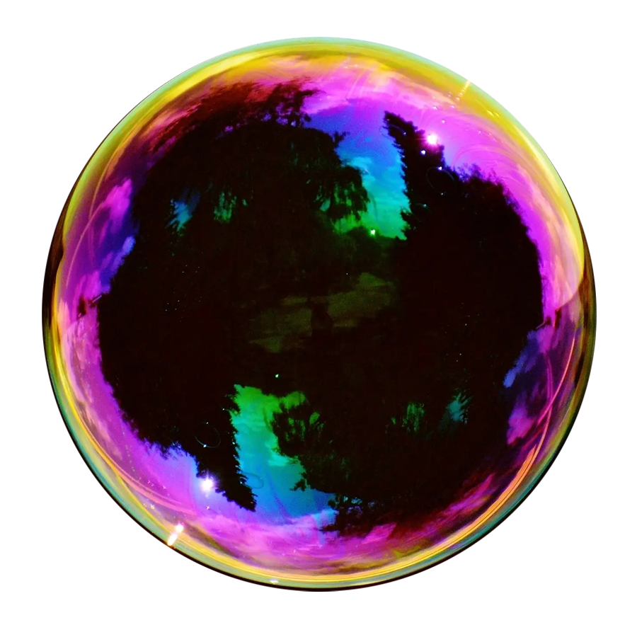

<p align="center">
    
</p>

# Bubbles

Bubbles is my Elixir project as an intern. It is a backend messaging app based on processes. The idea is that everything is a process.

To sign up in Bubbles use `Client.sign_up/2`. The first argument is your username which must be an atom. The second one is your password. It must be a string. This function starts a `User` process.

Let's create a user with username `:bubble` and password `"123456"` (shhhh). We will use `Client.sign_up/2`:

```elixir
iex(1)> Client.sign_up(:bubble, "123456")
:ok
```

We have successfuly started a `User` process with name `:bubble`. To sign in as `:bubble` we will use `Client.sign_in/2`.


```elixir
iex(2)> me = Client.sign_in(:bubble, "123456")
#PID<0.150.0>
```

```elixir
iex(3)> Client.inspect(me)
%{
  client: %ClientStruct{
    user_pid: #PID<0.150.0>,
    username: :bubble,
    password: "123456"
  },
  user: %UserStruct{
    id: #PID<0.150.0>,
    username: :bubble,
    password: :private,
    friends: [],
    requests: :private,
    mailbox: :private,
    active: true
  }
}
:ok
```

```elixir
iex(4)> Client.sign_up(:hubble, "123456")
:ok
iex(5)> you = Client.sign_in(:hubble, "123456")
#PID<0.160.0>
```

```elixir
iex(6)> me |> Client.send_request(:hubble)
:ok
```

```elixir
iex(7)> you |> Client.inspect_requests()
[:bubble]
:ok
```

```elixir
iex(8)> you |> Client.accept(:bubble)
:ok
```